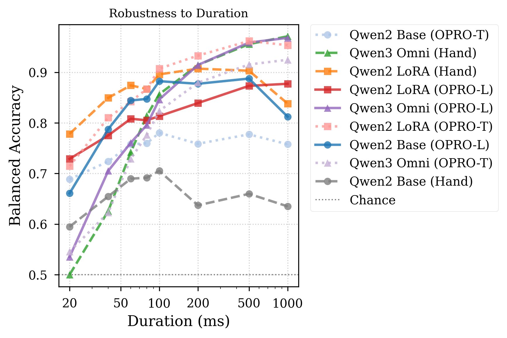
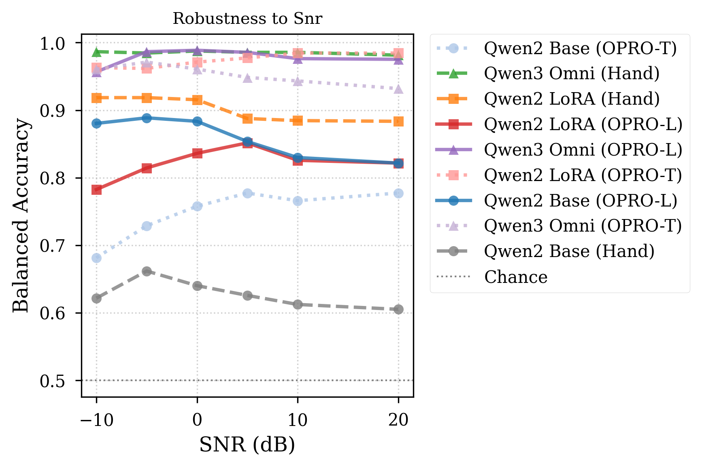
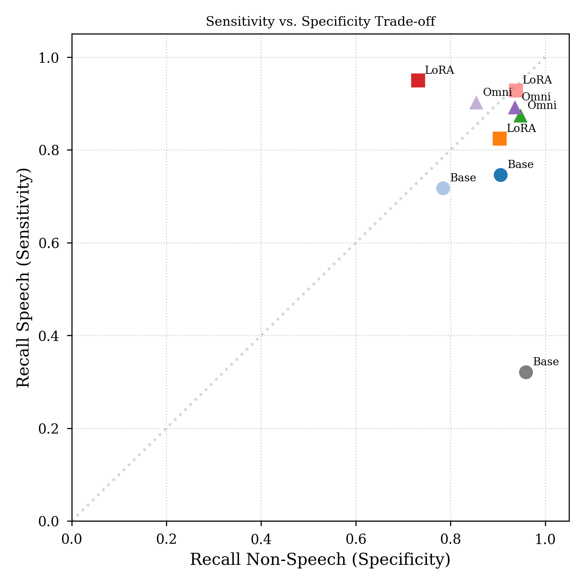

# Qwen VAD LoRA

Audio ML experiment for **robust Voice Activity Detection** with large audio-language models under short, noisy, reverberant, and filtered audio.

This repository is structured as an evidence package: problem, system design, evaluation, results, figures, and reproducibility artifacts.

## Portfolio signal

I adapted and evaluated audio-language models for a concrete binary audio task: classify clips as `SPEECH` or `NONSPEECH` under controlled degradations.

**Headline result:** `Qwen2-Audio-7B + LoRA + OPRO-Template` reached **93.3% balanced accuracy** on **21,340 degraded test clips**, outperforming a larger frozen `Qwen3-Omni-30B` baseline at **91.1%**.

What this demonstrates:

* Large audio-language model adaptation with LoRA.
* Prompt optimization beyond manual prompt engineering.
* Robust audio evaluation under degradation, not only clean aggregate accuracy.
* Auditable ML workflow with scripts, figures, tables, JSON metrics, CSV predictions, and statistical reports.
* Practical comparison against a specialist VAD baseline, Silero VAD.

## Problem

Voice Activity Detection is often treated as solved. It becomes less reliable when the model must decide from limited or degraded evidence:

* very short speech segments
* low signal-to-noise ratio
* reverberant rooms
* spectral filtering
* non-speech sounds that resemble speech, such as laughing, coughing, crying, or animal vocalizations

The core question is:

> Can an audio-language model remain reliable when speech evidence is degraded in controlled, deployment-relevant ways?

## What I built

I built a 3 x 3 experiment that separates three possible sources of robustness: model scale, weight adaptation, and prompt optimization.

| Layer | What was built | Files to inspect |
|---|---|---|
| Benchmark | Psychometric degradation bank over duration, SNR, reverberation, and filtering | `scripts/generate_extended_snr.py`, `scripts/plot_final_figures.py` |
| Model adaptation | LoRA fine-tuning for Qwen2-Audio-7B | `scripts/finetune.py` |
| Prompt optimization | OPRO-LLM and OPRO-Template search | `scripts/opro_llm.py`, `scripts/opro_template.py` |
| Evaluation | Full matrix evaluation across 9 system variants | `scripts/run_matrix.py`, `scripts/eval.py` |
| Baselines | Frozen Qwen3-Omni and Silero VAD comparison | `src/qsm/models/qwen3_omni.py`, `src/qsm/vad/silero.py` |
| Audit layer | Metrics, prediction dumps, statistical tests, and error analysis | `audits/`, `results/`, `tables/`, `figures/` |

### Experiment design

```text
Speech / non-speech audio
        ↓
Psychometric degradation bank
        ↓
Qwen2-Audio base     Qwen2-Audio + LoRA     Qwen3-Omni frozen
        ↓                    ↓                       ↓
Hand prompt          OPRO-LLM prompt         OPRO-Template prompt
        ↓                    ↓                       ↓
Predictions, metrics, bootstrap CIs, McNemar tests, figures, tables
```

The benchmark applies 22 degradation conditions per base sample.

| Axis | Conditions |
|---|---|
| Segment duration | 20, 40, 60, 80, 100, 200, 500, 1000 ms |
| Additive noise | -10, -5, 0, +5, +10, +20 dB |
| Reverberation | RT60 = 0.0, 0.3, 1.0, 2.5 s |
| Spectral filtering | none, bandpass, lowpass, highpass |

## Tech stack

**Models:** Qwen2-Audio-7B, Qwen3-Omni-30B, Silero VAD  
**Adaptation:** LoRA, PEFT, 4-bit quantization  
**Frameworks:** Python, PyTorch, Hugging Face Transformers, bitsandbytes  
**Audio:** 16 kHz mono clips, short-window VAD, controlled degradation banks  
**Evaluation:** balanced accuracy, speech recall, non-speech recall, bootstrap confidence intervals, McNemar tests  
**Workflow:** Slurm jobs, script-based orchestration, JSON/CSV audit artifacts, LaTeX tables, publication figures

## Result / evidence

### Headline comparison

| System | Role | Balanced accuracy | Speech recall | Non-speech recall |
|---|---|---:|---:|---:|
| Qwen2-Audio-7B + OPRO-LLM | prompt-only adaptation | 82.6% | 74.7% | 90.6% |
| **Qwen2-Audio-7B + LoRA + OPRO-Template** | **best adapted system** | **93.3%** | **92.8%** | **93.8%** |
| Qwen3-Omni-30B frozen + hand prompt | larger frozen baseline | 91.1% | 87.4% | 94.7% |
| Silero VAD, max-frame criterion | specialist VAD baseline | 88.9% | 78.8% | 99.1% |

Evidence files:

* `results/CONSOLIDATED_MATRIX_RESULTS.md`
* `results/CONSOLIDATED_MATRIX_RESULTS.json`
* `audits/round2/b2_normalization/06_lora_opro_template/metrics.json`
* `audits/round2/b2_normalization/07_qwen3_baseline/metrics.json`
* `audits/round2/B6_silero_results.md`

### Duration robustness

The best adapted system reaches **DT90 = 96 ms**, meaning it reaches 90% balanced accuracy with roughly 100 ms of speech evidence.

<p align="center">
  
</p>

Interpretation:

* The base model is conservative and misses speech under short durations.
* Prompt optimization improves sensitivity, but does not fully solve the problem.
* LoRA + OPRO-Template gives the strongest short-duration behavior.

### Noise robustness

LoRA adaptation changes the noise robustness profile. The adapted system remains useful at **-15 dB**, while the strongest frozen Qwen3 variants collapse to chance below -10 dB.

<p align="center">
  
</p>

Extended SNR audit:

| System | -20 dB BA | -15 dB BA | -10 dB BA |
|---|---:|---:|---:|
| LoRA + OPRO-Template | 51.2% | **83.3%** | 96.3% |
| Qwen3 + hand prompt | 50.0% | 51.6% | **98.7%** |
| Qwen3 + OPRO-LLM | 50.0% | 50.0% | 95.7% |

Evidence file:

* `audits/round2/B4_extended_snr_results.md`

### Sensitivity vs specificity

The systems do not fail in the same way. The base model tends to default to `NONSPEECH`. OPRO recovers speech recall. LoRA + OPRO gives the best balance between the two classes.

<p align="center">
  
</p>

### Reverberation and supplementary figures

Original figure assets included in the repo:

* `figures/Fig_Reverb.pdf`
* `figures/Fig_Overall_BA.pdf`
* `figures/supplementary/Fig_Supp_Calibration.png`
* `figures/supplementary/Fig_Supp_ErrorByDuration.png`

### Prompt optimization evidence

This was not a single manual prompt. The repo includes the prompt search history and summary analysis.

| Prompt-search evidence | Value |
|---|---:|
| Total prompt evaluations | 435 |
| Unique prompts | 71 |
| OPRO-LLM evaluations | 75 |
| OPRO-Template evaluations | 360 |

Evidence files:

* `audits/round1/B8_opro_prompt_analysis.md`
* `audits/round1/B8_opro_all_prompts.csv`
* `tables/Tab_PromptSummary.tex`

Multi-seed OPRO-Template stability:

| Model | Seeds | Mean BA | Std |
|---|---:|---:|---:|
| Base + OPRO-Template | 5 | 72.34% | 6.14 pp |
| **LoRA + OPRO-Template** | **5** | **91.80%** | **2.44 pp** |
| Qwen3 + OPRO-Template | 5 | 87.86% | 1.13 pp |

Evidence file:

* `audits/round3/B1_multiseed_opro.md`

### Failure analysis

Aggregate metrics are not enough for a deployable VAD system. The repo includes an ESC-50 category-level audit of non-speech confounders.

Hardest non-speech categories across configurations:

| Category | Acoustic group | Mean accuracy across configs | Best-system accuracy |
|---|---|---:|---:|
| laughing | human vocalization | 43.9% | 31.8% |
| coughing | human vocalization | 56.4% | 56.6% |
| crying_baby | human vocalization | 60.4% | 77.3% |

Evidence files:

* `audits/round1/B7_esc50_accuracy_report.md`
* `audits/round1/B7_esc50_category_accuracy.csv`
* `figures/esc50_heatmap.pdf`

## How to run / demo

### 1. Clone

```bash
git clone <repo-url>
cd qwen-vad-lora
```

### 2. Inspect the evidence package

```bash
cat results/CONSOLIDATED_MATRIX_RESULTS.md
cat audits/round2/B4_extended_snr_results.md
cat audits/round2/B6_silero_results.md
cat audits/round3/B1_multiseed_opro.md
cat audits/round1/B8_opro_prompt_analysis.md
```

### 3. Recompute the headline table from JSON metrics

This uses only the Python standard library.

```bash
python - <<'PY'
import json

systems = {
    "Base + OPRO-LLM": "audits/round2/b2_normalization/02_base_opro_llm/metrics.json",
    "LoRA + OPRO-Template": "audits/round2/b2_normalization/06_lora_opro_template/metrics.json",
    "Qwen3 + Hand": "audits/round2/b2_normalization/07_qwen3_baseline/metrics.json",
}

print(f"{'system':<24} {'BA':>8} {'speech':>8} {'nonspeech':>10} {'n':>8}")
for name, path in systems.items():
    with open(path) as f:
        m = json.load(f)
    print(
        f"{name:<24} "
        f"{100*m['ba_clip']:>7.1f}% "
        f"{100*m['speech_acc']:>7.1f}% "
        f"{100*m['nonspeech_acc']:>9.1f}% "
        f"{m['n_samples']:>8}"
    )
PY
```

Expected output:

```text
system                         BA   speech  nonspeech        n
Base + OPRO-LLM             82.6%    74.7%      90.6%    21340
LoRA + OPRO-Template        93.3%    92.8%      93.8%    21340
Qwen3 + Hand                91.1%    87.4%      94.7%    21340
```

### 4. Regenerate analysis artifacts

Some scripts require the original prediction files and expected directory layout, but the main analysis entry points are included:

```bash
python scripts/analyze_multiseed_opro.py
python scripts/analyze_normalization_levels.py
python scripts/analyze_silero.py
python scripts/extract_esc50_accuracy.py
python scripts/plot_final_figures.py
python scripts/make_tables.py
```

### 5. Run the experiment orchestrator

```bash
python scripts/run_matrix.py --dry_run
python scripts/run_matrix.py --cells 1A,1B,2A,2C
```

Full reruns require access to the original audio data, model weights, GPU environment, and checkpoints.

## Repository map

```text
.
├── audits/                 # Round-by-round audit reports, CSVs, and prediction summaries
├── figures/                # Main and supplementary result figures
├── results/                # Consolidated matrix results and statistical analysis
├── scripts/                # Training, evaluation, OPRO, plotting, and audit scripts
├── slurm/                  # HPC job templates and submitted job files
├── src/qsm/                # Qwen model wrappers, normalization utilities, VAD interfaces
├── tables/                 # LaTeX result tables
├── main.tex                # Manuscript draft
├── config.yaml             # Experiment configuration
└── PROGRESS.md             # Audit and improvement log
```

## What a hiring manager can verify quickly

* I can turn an open research question into a controlled benchmark.
* I can fine-tune and evaluate large audio-language models with a clear experimental design.
* I can compare model adaptation, prompt optimization, and specialist baselines fairly.
* I can produce auditable ML artifacts instead of only reporting final scores.
* I can identify failure modes that matter for deployment.

## Limitations

* Raw datasets and trained checkpoints are not included in this public snapshot.
* Some scripts assume the original HPC data paths and GPU environment.
* Figure PDFs are included for paper use; PNGs are used in this README where available.
* The repository is best read as an applied research and audit package, not as a plug-and-play VAD library.

## Author

**Gabriel Bibbó**  
Audio ML Research Engineer  
Sound event detection · Voice activity detection · audio-language models · robust evaluation
