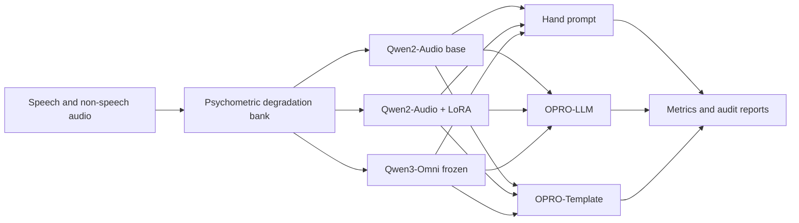

# Qwen VAD LoRA

Robust Voice Activity Detection with audio-language models under short, noisy and degraded audio.

This repository documents an applied audio ML experiment: can a parameter-efficient 7B audio-language model be adapted to classify `SPEECH` vs `NONSPEECH` more robustly than larger frozen models?

**Result:** Qwen2-Audio-7B with LoRA + OPRO-Template reached **93.3% balanced accuracy** on **21,340 degraded test clips**, outperforming a frozen Qwen3-Omni 30B baseline at **91.1% balanced accuracy** in the same benchmark.

## Problem

Voice Activity Detection is usually treated as a solved preprocessing step. It is less solved when the audio is short, noisy, reverberant, filtered or mixed with non-speech sounds that resemble speech.

This project tests a harder question:

> Can a large audio-language model remain reliable when speech evidence is degraded in controlled ways?

The benchmark stresses four failure modes that matter in real deployments:

| Degradation axis | Conditions |
|---|---|
| Segment duration | 20, 40, 60, 80, 100, 200, 500, 1000 ms |
| Additive noise | SNR from -10 dB to +20 dB in the main bank, extended to -20 dB for top systems |
| Reverberation | RT60 from 0.0 s to 2.5 s |
| Spectral filtering | none, bandpass, lowpass, highpass |

The test set contains **21,340 clips**, balanced across **10,670 speech** and **10,670 non-speech** examples.

## What I built

I built an experimental pipeline for adapting and auditing audio-language models for binary VAD:

1. **A psychometric degradation benchmark** with 22 controlled conditions per test bank.
2. **A 3 x 3 comparison matrix** crossing model configuration and prompt strategy.
3. **LoRA fine-tuning for Qwen2-Audio-7B**, using 4-bit quantization and parameter-efficient adaptation.
4. **Two prompt optimization methods**:
   - OPRO-LLM: generative prompt search with a meta-LLM.
   - OPRO-Template: deterministic search over structured prompt templates.
5. **A result audit layer** with exported predictions, JSON metrics, normalization checks, seed stability checks and error breakdowns.
6. **Baselines and stress tests** against frozen Qwen3-Omni and Silero VAD.



## Tech stack

| Area | Tools and methods |
|---|---|
| Models | Qwen2-Audio-7B, Qwen3-Omni-30B, Silero VAD |
| Adaptation | LoRA, PEFT, 4-bit NF4 quantization, gradient checkpointing |
| Prompt optimization | OPRO-LLM, OPRO-Template, prompt reward search |
| ML framework | Python, PyTorch, Hugging Face Transformers, bitsandbytes |
| Audio processing | 16 kHz mono audio, short-window VAD, degradation banks |
| Evaluation | balanced accuracy, speech recall, non-speech recall, per-condition metrics |
| Reproducibility | CSV predictions, JSON metrics, multi-seed runs, audit reports |
| Compute | Slurm/HPC workflow, A100-class evaluation environment |

## Result / evidence

### Headline model comparison

| System | Role in experiment | Balanced accuracy | Speech recall | Non-speech recall | Evidence artifact |
|---|---:|---:|---:|---:|---|
| Qwen2-Audio-7B + OPRO-LLM | prompt optimization only | 82.6% | 74.7% | 90.6% | `audits/round2/b2_normalization/02_base_opro_llm/metrics.json` |
| Qwen2-Audio-7B + LoRA + OPRO-Template | best adapted system | **93.3%** | **92.8%** | **93.8%** | `audits/round2/b2_normalization/06_lora_opro_template/metrics.json` |
| Qwen3-Omni-30B frozen + hand prompt | larger frozen baseline | 91.1% | 87.4% | 94.7% | `audits/round2/b2_normalization/07_qwen3_baseline/metrics.json` |
| Silero VAD, max-frame criterion | specialist VAD baseline | 88.9% | 78.8% | 99.1% | `audits/round2/B6_silero_results.md` |

The main signal is practical: a smaller adapted 7B model beat a larger frozen audio-language model on this benchmark.

### Robustness under extreme noise

The extended SNR audit added -15 dB and -20 dB noise levels for the strongest systems.

| System | -20 dB BA | -15 dB BA | -10 dB BA | Evidence artifact |
|---|---:|---:|---:|---|
| LoRA + OPRO-Template | 51.2% | **83.3%** | 96.3% | `audits/round2/B4_extended_snr_results.md` |
| Qwen3 + hand prompt | 50.0% | 51.6% | **98.7%** | `audits/round2/B4_extended_snr_results.md` |
| Qwen3 + OPRO-LLM | 50.0% | 50.0% | 95.7% | `audits/round2/B4_extended_snr_results.md` |

At -15 dB, the LoRA-adapted model still produced useful decisions. The frozen Qwen3 systems collapsed to near chance.

### Prompt optimization evidence

The prompt search was not a single hand-written prompt. The audit artifacts include:

| Evidence | Value | Artifact |
|---|---:|---|
| Total prompt evaluations | 435 | `audits/round1/B8_opro_prompt_analysis.md` |
| Unique prompts | 71 | `audits/round1/B8_opro_prompt_analysis.md` |
| OPRO-LLM prompt evaluations | 75 | `audits/round1/B8_opro_prompt_analysis.md` |
| OPRO-Template prompt evaluations | 360 | `audits/round1/B8_opro_prompt_analysis.md` |

Multi-seed template search also supports the main result:

| Model | Seeds | Mean BA | Std | Range | Artifact |
|---|---:|---:|---:|---:|---|
| Base + OPRO-Template | 5 | 72.34% | 6.14 pp | 61.36 to 75.08% | `audits/round3/B1_multiseed_opro.md` |
| LoRA + OPRO-Template | 5 | **91.80%** | 2.44 pp | 87.66 to 93.29% | `audits/round3/B1_multiseed_opro.md` |
| Qwen3 + OPRO-Template | 5 | 87.86% | 1.13 pp | 86.34 to 89.54% | `audits/round3/B1_multiseed_opro.md` |

### Failure analysis

The repository includes category-level analysis on ESC-50 non-speech sounds. The hardest categories were mostly human or animal vocalizations, which are plausible confounders for speech detection.

| Category | Group | Mean accuracy across configs | LoRA + OPRO-Template accuracy | Artifact |
|---|---|---:|---:|---|
| laughing | Human vocalizations | 43.9% | 31.8% | `audits/round1/B7_esc50_accuracy_report.md` |
| coughing | Human vocalizations | 56.4% | 56.6% | `audits/round1/B7_esc50_accuracy_report.md` |
| crying_baby | Human vocalizations | 60.4% | 77.3% | `audits/round1/B7_esc50_accuracy_report.md` |

This matters because a deployable VAD system should not only report aggregate accuracy. It should expose the specific acoustic classes that create risk.

## How to run / demo

### Current repository status

This public snapshot is an **evidence and audit package**. It contains exported predictions, metrics and analysis reports. It does **not** include the full training scripts, model checkpoints, raw audio data or figure images referenced by earlier internal drafts.

For that reason, you can inspect and recompute the included result summaries locally, but you cannot fully re-run LoRA training or the complete GPU experiment from this snapshot alone.

### Inspect the main evidence

```bash
# Clone the repository
git clone <repo-url>
cd qwen-vad-lora

# Main result artifacts
cat audits/round2/B6_silero_results.md
cat audits/round2/B4_extended_snr_results.md
cat audits/round3/B1_multiseed_opro.md
cat audits/round1/B8_opro_prompt_analysis.md

# Inspect exported predictions for the best system
head -5 audits/round2/b2_normalization/06_lora_opro_template/predictions.csv
```

### Recompute the headline table from included JSON files

This script uses only the Python standard library.

```bash
python - <<'PY'
import json

systems = {
    "Base + OPRO-LLM": "audits/round2/b2_normalization/02_base_opro_llm/metrics.json",
    "LoRA + OPRO-Template": "audits/round2/b2_normalization/06_lora_opro_template/metrics.json",
    "Qwen3 + Hand": "audits/round2/b2_normalization/07_qwen3_baseline/metrics.json",
}

print(f"{'system':<24} {'BA':>8} {'speech':>8} {'nonspeech':>10} {'n':>8}")
for name, path in systems.items():
    with open(path) as f:
        m = json.load(f)
    print(
        f"{name:<24} "
        f"{100*m['ba_clip']:>7.1f}% "
        f"{100*m['speech_acc']:>7.1f}% "
        f"{100*m['nonspeech_acc']:>9.1f}% "
        f"{m['n_samples']:>8}"
    )
PY
```

Expected output:

```text
system                         BA   speech  nonspeech        n
Base + OPRO-LLM             82.6%    74.7%      90.6%    21340
LoRA + OPRO-Template        93.3%    92.8%      93.8%    21340
Qwen3 + Hand                91.1%    87.4%      94.7%    21340
```

## Repository contents

```text
.
├── README.md
├── PROGRESS.md
├── CLAUDE.md
├── _concat_code.py
└── audits/
    ├── paper_audit_20260213.md
    ├── round1/
    │   ├── B5_hyperparameter_audit.md
    │   ├── B7_esc50_accuracy_report.md
    │   └── B8_opro_prompt_analysis.md
    ├── round2/
    │   ├── B2_normalization_level_breakdown.md
    │   ├── B4_extended_snr_results.md
    │   ├── B6_silero_results.md
    │   └── b2_normalization/
    └── round3/
        ├── B1_multiseed_opro.md
        └── data_curve/
```

## What this demonstrates

This repository is evidence of work in:

- adapting large multimodal/audio-language models for a concrete audio classification task;
- designing controlled degradation benchmarks instead of relying on clean aggregate accuracy;
- comparing model adaptation, prompt optimization and specialist VAD baselines;
- running and auditing experiments through exported metrics, predictions and reproducibility checks;
- identifying failure modes that matter for deployment, especially short segments, extreme noise and human-like non-speech sounds.

## Limitations

- The raw audio data and full execution code are not included in this snapshot.
- The prediction CSVs keep absolute paths from the original HPC environment.
- No image assets are present in this ZIP, so this README avoids broken figure links.
- The repository should be read as an experiment evidence package, not as a standalone training library.

## Author

Gabriel Bibbo

Audio ML Research Engineer focused on sound event detection, voice activity detection, audio-language models and robust evaluation under real-world degradations.
